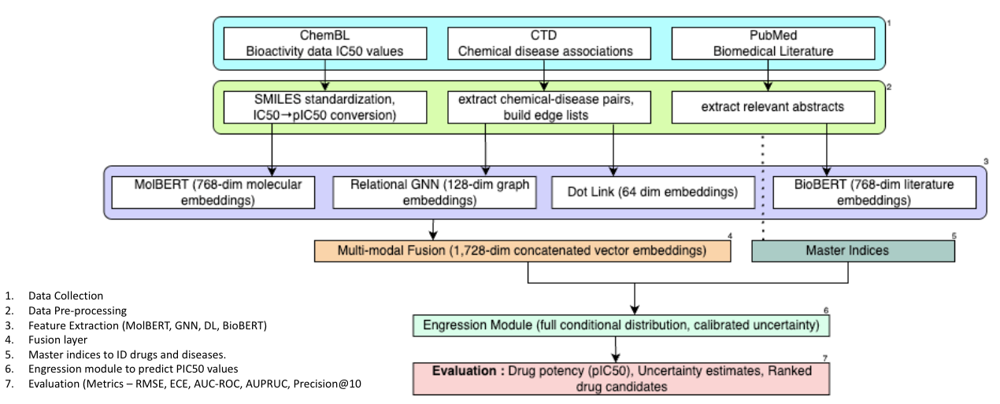
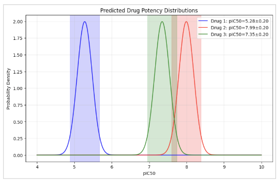
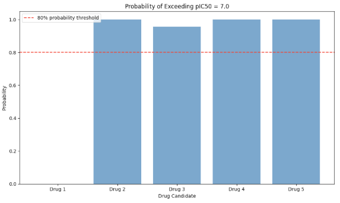

# AI-Driven Drug Repurposing with Multi-Modal Deep Learning and Engression

This repository contains the code and supporting data for our research on **AI-driven drug repurposing**, integrating molecular, biomedical, and graph-based data into a unified deep learning pipeline.

Our framework combines **MolBERT**, **BioBERT**, and **Graph Neural Networks (GNNs)** with a **heteroscedastic regression network** and an **Engression module** for modeling full conditional uncertainty.  
It achieves strong performance in predicting drug potency (pIC₅₀), calibrated confidence intervals, and ranked candidate selection.

---

## 🧠 Overview

Drug repurposing identifies new therapeutic uses for existing drugs, drastically cutting development time and cost.  
This project leverages multiple data modalities:

- **Molecular features** via [MolBERT](https://arxiv.org/abs/2011.13230) (SMILES embeddings)  
- **Textual context** from [BioBERT](https://academic.oup.com/bioinformatics/article/36/4/1234/5566506) (PubMed abstracts)  
- **Relational structure** using Graph Neural Networks over CTD (Chemical–Disease–Gene relations)  
- **Uncertainty calibration** using **Engression**, which models the full conditional distribution of predicted drug potency  

---

## ⚙️ Pipeline



**Fig 1.** Multi-modal, uncertainty-aware deep learning framework for AI-driven drug repurposing.

1. **Data Sources:** ChEMBL bioactivity data, CTD chemical–disease associations, PubMed literature.  
2. **Preprocessing:** SMILES standardization, pIC₅₀ conversion, edge-list construction, literature extraction.  
3. **Embedding Extraction:** MolBERT (molecular), GNN (graph), BioBERT (text).  
4. **Multi-modal Fusion:** Concatenation of 1,728-dimensional embeddings.  
5. **Engression Module:** Full conditional distribution modeling for calibrated uncertainty.  
6. **Evaluation:** RMSE, ECE, AUC-ROC, AUPRC, and Precision@10 metrics.  

---

## 🧩 Key Components

| Component | Description |
|------------|-------------|
| **MolBERT** | Learns molecular embeddings from SMILES strings, capturing chemical semantics. |
| **BioBERT** | Extracts literature-based relationships and context for each drug or disease. |
| **Relational GNN** | Encodes multi-hop associations from CTD into relational graph embeddings. |
| **Engression** | Models complete conditional distribution of pIC₅₀ to capture predictive uncertainty. |
| **Fusion Layer** | Concatenates all embeddings (1,728-D) and feeds into a heteroscedastic neural network. |

---

# 📊 Results & Case Study

We evaluate our pipeline using regression, classification, calibration, and ranking metrics.  
The model demonstrates strong predictive accuracy and well-calibrated uncertainty estimates, supporting reliable drug candidate selection.

---

### Evaluation Metrics and Performance

We assess regression using **RMSE**, uncertainty calibration with **Expected Calibration Error (ECE)**, and link prediction with **AUC-ROC**, **AUPRC**, and **Precision@10**, which measures precision among the top 10 predictions.  
Models not using graph-based features (MolBERT, BioBERT) are excluded from link-level metrics.  
Statistical significance is verified through 1,000 bootstrap resamples and paired tests (*p* < 0.01).

| **Model Variant** | **RMSE ↓** | **ECE (%) ↓** | **AUC-ROC ↑** | **AUPRC ↑** | **Precision@10** |
|--------------------|------------|----------------|----------------|---------------|------------------|
| GNN only | 1.12 ± 0.03 | 12.8 | 0.85 ± 0.01 | 0.32 ± 0.02 | 0.60 |
| Text only (BioBERT) | 1.05 ± 0.02 | 10.5 | — | — | — |
| MolBERT only | 0.98 ± 0.02 | 9.7 | — | — | — |
| **Multi-modal + Engression** | **0.85 ± 0.02** | **4.3** | **0.93 ± 0.01** | **0.52 ± 0.03** | **1.00** |

**Table 1.** Performance comparison across model variants.

Our multi-modal model with Engression achieves the best performance:  
24 % lower RMSE than GNN-only, an ECE of 4.3 %, and perfect Precision@10 — reliably identifying top repurposing candidates.

---

### Case Study — MESH:C000598644

To evaluate real-world utility, we applied the model to disease **MESH:C000598644**.  
It identified five high-confidence drug candidates, all showing strong agreement across modalities:

- **Drug 1:** pIC₅₀ = 5.28 ± 0.20; Confidence = 10.00; Link Score = 0.999  
- **Drug 2:** pIC₅₀ = 7.99 ± 0.20; Confidence = 10.00; Link Score = 0.773  
- **Drug 3–5:** pIC₅₀ > 7.3; Confidence = 10.00; Minimal link score  

While Drug 1 shows the strongest graph evidence, four candidates exceed the pIC₅₀ = 7.0 threshold, making them prime candidates for validation.  
The figures below illustrate both potency distributions and exceedance probabilities, confirming prediction quality and calibrated confidence.

<table>
  <tr>
    <td align="center">
      <br>
      <sub><b>Fig 7.</b> Predicted drug potency distributions with 1 σ shading.</sub>
    </td>
    <td align="center">
      <br>
      <sub><b>Fig 8.</b> Probability of exceeding pIC₅₀ = 7.0 for each drug candidate.</sub>
    </td>
  </tr>
</table>

Clear separation is observed between Drug 1 and others, with tight confidence intervals.  
Drugs 2–5 mostly exceed the therapeutic threshold.  
The multi-modal fusion prevented false positives from graph-only features (e.g., Drug 1) and correctly identified Drug 2 as the top candidate through complementary cross-modal evidence.

Residual analyses confirmed homoscedasticity and normality, indicating well-satisfied model assumptions.  
This comprehensive evaluation shows that our pipeline achieves **state-of-the-art accuracy** and **robust uncertainty calibration**, essential for reliable drug repurposing.  
The combination of predictive performance, calibrated confidence, and diagnostic stability confirms its readiness for **experimental prioritization and decision support**.

---

## 🧬 Repository Structure
```
Drug-Repurposing-MultiModal-DL-GNN-Engression/
│
├── main.ipynb                 # Full research notebook (end-to-end pipeline)
├── data/                      # Folder for example or small datasets
│   ├── sample_activities.csv
│   └── pubmed_embeddings.parquet
├── images/                    # Figures used in README
│   ├── framework.png
│   ├── results_1.png
│   └── results_2.png
├── requirements.txt           # Environment dependencies
├── LICENSE                    # MIT License
└── README.md                  # Project documentation (this file)
```
---

## 📦 Installation

```bash
git clone https://github.com/<your-username>/Drug-Repurposing-MultiModal-DL-GNN-Engression.git
cd Drug-Repurposing-MultiModal-DL-GNN-Engression
```
---
## 🚀 Usage

Open and run the notebook: 
```
jupyter notebook main.ipynb
```
You can modify data paths in the preprocessing section. Sample data and embeddings are provided for reproducibility.

---
## 📘 Citation

If you use this code, please cite the accompanying preprint:

Pendyala, M., & Ramsundar, A. (2025).
AI-Driven Drug Repurposing Using Multi-Modal Deep Learning and Graph Neural Networks.
arXiv preprint (in submission).

---
## 📄 License

This project is licensed under the [MIT License](LICENSE).
